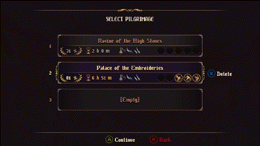
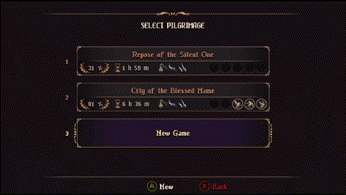

## Alt Tab Early Control

|                           |                           |
|---------------------------|---------------------------|
| **Speedrun Categories**   | Unrestricted%, Restricted% (Intro Skip only) |
| **Game Version**          | 1.0.5                     |
| **Requirements**          | None                      |
| **Setup Required**        | No                        |
| **Pixel/Frame related?**  | No                        |
| **Change Game Behavior?** | Can cause softlocks       |

### Description

During a load, minimize and restore game window can lead to gaining control of TPO before load proper finishes. It can be used to attack a boss in the middle of its cutscene (notably Devotion Incarnate), skip game intro and start to play a few moments earlier

### Game Behavior

When perfoming this trick with safe position setted as a Prie Dieu in a small room, be aware that if TPO hits a scene transition too fast it may causes the game to never loads the scene thus causing a softlock; a simple reset will solve it.

It can be avoided by waiting TPO to finishes its Prie Dieu's spawn animation.

### How to Perform

- After loading a file or start a new game, press alt+tab or Windows+D a few times while holding a direction (left or right) in your gamepad/keyboard
- You can either mash buttons or press it when load starts; both works but the later is harder to perform

### List of Usages

#### Intro Skip

(click on image for better quality)

